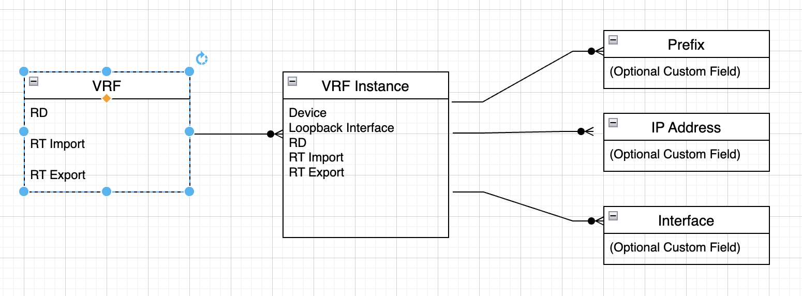

# NetBox VRF Extensions Plugin

A [Netbox](https://github.com/netbox-community/netbox) plugin for more realistically modelling service provider VRF environments.

## Features

This plugin provides the following model:

-   VRF Instance - a model to define an instance of a VRF associated with a device.

Additionally the VRF Instance allows:

-   Optional specification of an associated loopback interface
-   Override of primary VRF route distinguishers and route targets

### Object Model Overview



## Compatibility

Each Plugin Version listed below has been tested with its corresponding NetBox Version.

| NetBox Version | Plugin Version |
| :------------: | :------------: |
|      4.0       |     1.0.0      |

## Contributing

This project is currently maintained jointly by:

-   [Chris Russell](https://github.com/cruse1977)

See the [CONTRIBUTING](CONTRIBUTING.md) for more information.


## Installing

For adding to a NetBox Docker setup see
[the general instructions for using netbox-docker with plugins](https://github.com/netbox-community/netbox-docker/wiki/Using-Netbox-Plugins).

You can install with pip:

```bash
pip install netbox-vrf-ext
```

or by adding to your `local_requirements.txt` or `plugin_requirements.txt` (netbox-docker):

```bash
netbox-acls
```

## Configuration

Enable the plugin in `/opt/netbox/netbox/netbox/configuration.py`,
or if you use netbox-docker, your `/configuration/plugins.py` file :

```python
PLUGINS = [
    "netbox_vrf_ext"
]

PLUGINS_CONFIG = {
    "netbox_vrf_ext": {
    },
}
```

To add the required `netbox-vrf-ext` tables to your NetBox database, run the `migrate` manager subcommand in the NetBox virtual environment:

```
cd /opt/netbox
sudo ./venv/bin/python3 netbox/manage.py makemigrations
sudo ./venv/bin/python3 netbox/manage.py migrate
```

## Developing

### Docker Container

The docker-develop directory contains a fully functioning docker setup to create a development environment. This includes a netbox 4.x instance with the plugin installed.

Directions for use

```
cd docker-develop
docker compose pull
docker compose build
docker compose up
docker exec -it docker-develop-netbox-1 /opt/netbox/netbox/manage.py createsuperuser
```

Your netbox instance will be served under 0.0.0.0:8000, so it should now be available under localhost:8000.

#### Optional Custom Fields ####

* Optional Fields on Prefix, IPAddress, Interface

```
cd /opt/netbox
sudo ./venv/bin/python3 netbox/manage.py setup_vrfinstance_fields


## Screenshots

VRF Instance

VRF Instance on VRF Page

VRF Instance Tab on Device Page
